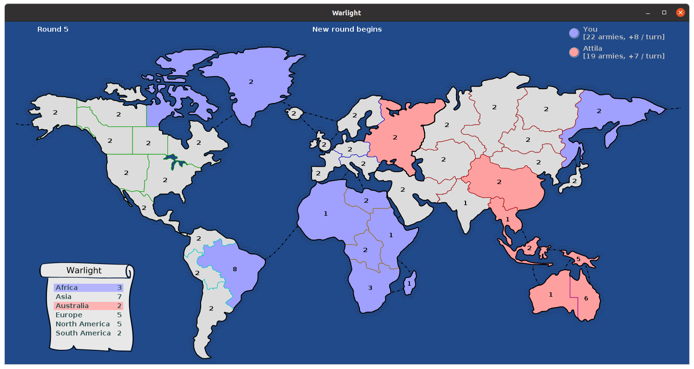

# Warlight



Warlight is a two-player strategy game based on the classic board game [Risk](https://en.wikipedia.org/wiki/Risk_(game)).  This implementation in Java lets you write AI agents that play the game.

The code here is derived from the [original implementation](http://theaigames.com/competitions/warlight-ai-challenge) at theaigames.com.  My colleague Jakub Gemrot at Charles University made extensive changes, adding an interactive visual map so that human players can play against the computer.  I have made various changes as well, building on Jakub's work.

## Quick start

To play the game from the keyboard on Linux or macOS, run

```
$ ./warlight
```

Or, on Windows:

```
> .\warlight
```

By default, you will play against the example bot `bots.AggressiveBot`.  To play against a different bot, specify its name on the command line:

```
$ ./warlight bots.RandomBot
```

Specify two bot names to watch one of them play the other:

```
$ ./warlight bots.AggressiveBot bots.RandomBot
```

To run a series of games between two bots with no visualization, specify the '-sim' option with a number of games to play, e.g.

```
$ ./warlight bots.AggressiveBot bots.RandomBot -sim 10
```

## Game rules

Warlight is played on a world map that contains 42 regions divided into 6 continents (Africa, Asia, Australia, Europe, North America, South America).

At the beginning of the game, each player must choose 3 starting regions.  The selection process happens as follows.  First the computer picks 12 random regions that are available for selection.  These will always include 2 regions on each of the 6 continents.  The players take turns picking a single region at a time from the available regions until they have each chosen 3 starting regions.  Each player receives 2 armies on each of their starting regions.  All other starting regions are initially neutral, and begin with 2 neutral armies.

Now the main part of the game begins.  The game proceeds in a series of rounds.  In each round, the following events occur:

1. player 1 places new armies
2. player 1 moves/attacks
3. player 2 places new armies
4. player 2 moves/attacks

In each round, each player can place a number of new armies on their territories.  Each player normally receives 5 new armies, plus bonus armies for each continent that they currently control.  A player controls a continent if they own all regions on that continent.  Larger continents yield more bonus armies; the game map displays the number of bonus armies available for each continent.

As an exception to the above, in the first round player 1 receives only 2 armies, not 5.  This is intended to compensate for the advantage of moving first.

In each round, each player can perform a series of moves or attacks.  A player can move armies between adjacent territories that they own.  As least one army must always stay behind in any move or attack; it is not possible to abandon a territory.

In an attack, a player moves a number of armies to an adjacent territory that is neutral or owned by the other player.  An attack consists of a series of combat rounds.  In each combat round, the attacker has a 70% chance of losing one army, and the defender has a 60% chance of losing one army.  The combat rounds continue until either the attacker or defender have no armies left.  If all attacking armies are destroyed, the attack has failed.  If all defending armies are destroyed, the attack succeeds, and the remaining armies occupy the territory.  If all attacking and defending armies are destroyed, the defender is granted one extra army and the attack fails.

In each game round, each army may move or attack only once.  For example, suppose that player 1 has 6 armies in North Africa, and moves 4 more armies from Congo to North Africa.  In that same round, the player may attack from North Africa to Brazil with at most 5 armies; the newly arrived armies may not attack.  Suppose that the attack succeeds and 4 surviving armies occupy Brazil.  The player must wait until the next round before launching a subsequent attack from Brazil.

The game is played until one player has no armies remaining; that player has lost.  If 100 rounds are played and both players still have armies on the board, the player with the most regions wins.  If both players have the same number of regions, the player with the most armies wins.  If both players have the same number of regions and armies (which is extremely unlikely), the game is a draw.

## User interface

When playing as a human against a bot, click the map or press the space bar to advance past informational messages such as "New Round".  When placing or moving armies, use the left mouse button to add armies to be placed/moved and use the right mouse button to subtract armies.  To move or attack, first click a source region, then repeatedly click a destination region until you have moved as many armies as you like.  Enter all your moves or attacks for a single round before pressing DONE.

When two bots are playing each other, you can left click the map or press the space bar to advance to the next action.  Press 'N' to skip to the next game round.  To fast forward through the game, right click the map and hold the mouse button down.  Alternatively, press 'C' to enter continuous mode, in which the game will periodically advance to the next action automatically.  In this mode, press '+' and '-' to adjust the time delay between actions.

## Writing a bot

The class `MyBot` contains a dummy bot that plays randomly, i.e. it is equivalent to RandomBot.  Usually MyBot will lose.  You can use MyBot as a starting point for developing your own game-playing agent.

Here is [documentation](https://ksvi.mff.cuni.cz/~dingle/2019/ai/warlight/warlight_api.html) for the Warlight API.
